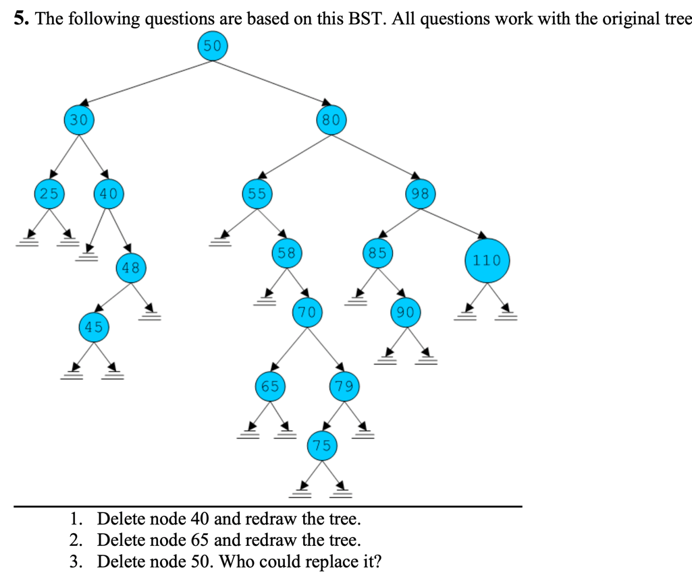

**IN ORDER: left, root, right**  
**POST ORDER: left, right, root**  
**PRE ORDER: root, left, right**  

**ANSWER to 1: in-order**

**ANSWER to 2: pre-order**

**ANSWER to 3: none**

**ANSWER to 4: post-order**

5.1: delete node 40 and redraw tree
>
>           50
>           |- - 30
>           |    `- - 25
>           `- - 80
>                |- - 55
>                |    `- - 58
>                |         `- - 70
>                |              |- - 65
>                |              `- - 79
>                |                   `- - 75
>                `- - 98
>                     |- - 85
>                     |    `- - 90
>                     `- - 110
5.2: delete node 65 and redraw tree
>           50
>           |- - 30
>           |    `- - 25
>           `- - 80
>                |- - 55
>                |    `- - 58
>                |         `- - 70
>                |              `- - 79
>                |                   `- - 75
>                `- - 98
>                     |- - 85
>                     |    `- - 90
>                     `- - 110
5.3: delete node 50, who could replace it? 75  
because 75 is the first node traversed through the tree  
that satisfies 80 > 75 > 30 and is a leaf node.
>           75
>           |- - 30
>           |    `- - 25
>           `- - 80
>                |- - 55
>                |    `- - 58
>                |         `- - 70
>                |              `- - 79
>                `- - 98
>                     |- - 85
>                     |    `- - 90
>                     `- - 110

>
> PREORDER: ROOT,LEFT,RIGHT
> POSTORDER: LEFT,RIGHT,ROOT
> INORDER: LEFT, ROOT, RIGHT
> 
> 6.1:
> PREORDER: 40, 30, 25, 20, 35, 50, 48, 42, 80, 55, 98  
> 6.2:
> POSTODER: 20, 25, 35, 30, 42, 48, 55, 98, 80, 50, 40  
> 6.3:
> INORDER__: 20, 25, 30, 35, 40, 42, 48, 50, 55, 80, 98  
> 

